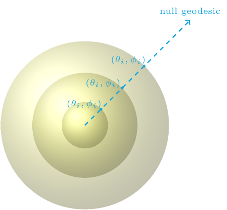

When we numerically simulate the dynamics of gravitational systems we often imagine foliating the spacetime with hypersurfaces of constant time. A common foliation choice is spacelike hypersurfaces, which can form a Cauchy setup used for instance to study the region near the merger of two black holes. Another foliation choice is null hypersurfaces, which form the characteristic setup of general relativity. Since light and gravitational waves travel on null hypersurfaces, the characteristic setup is particularly useful in radiation problems.

The characteristic setup of general relativity is typically constructed using Bondi-like coordinates. Let us for concreteness focus on a physical situation where gravitational waves travel away form their source and towards future null infinity. In this case, the various Bondi-like coordinates follow outgoing null geodesics. Different Bondi-like coordinates parametrize null geodesics in a different way, for instance using an affine parameter (affine-null coordinates), or using the areal radius of  concentric two spheres (the Bondi-Sachs proper coordinates). In all such coordinate systems however, the different outgoing null geodesics can be labelled by the transverse coordinates, for instance the angles (θ, φ) on a two sphere.

In this project, together with Nigel Bishop, David Hilditch, Denis Pollney, and Miguel Zilhão, we investigated the hyperbolicity of these characteristic formulations of general relativity and its implication in applications. More specifically, in [Hyperbolicity of General Relativity in Bondi-like gauges](../../publication/2007.06419) found that some commonly used Bondi-like characteristic setups are only weakly hyperbolic. After this, in [Gauge structure of the Einstein field equations in Bondi-like coordinates](../../publication/2111.14794) we found that weak hyperbolicity of these setups is caused by the gauge fixing, which geometrically can be viewed as the fact that distinct null geodesics are labelled by e.g angles on the two sphere. We argued that all Bondi-like characteristc systems with up to second order metric derivatives are weakly hyperbolic due to this gauge structure. Finally, in [Numerical convergence of model Cauchy-characteristic extraction and matching](../../publication/2306.13010) we discuss the implication of this result in gravitational waveform modelling applications, specifically the Cauchy-characteristic extraction and matching methods. In brief, the mathcing method is ill-posed in any norm, whereas the extraction method could be weakly well-posed in a certain norm, provided that the characteristic initial boundary value problem of the weakly hyperbolic Bondi-like systems is weakly well-posed. It is not known however if the latter is true.

In the future, a possible goal of this project is to propose different characteristic formulations that are strongly or symmetric hyperbolic. The focus is on metric formulations with up to second order derivatives. There are different formulations that involve up to third order metric derivatives that promote the curvature as independent variable, which are symmetric hyperbolic in Bondi-like gauges. Another possible goal is to investigate further the relation of the second and third order formulations, as well as the possible weak well-posednes of characteristic initial (boundary) value problem of the second order Bondi-like systems.
